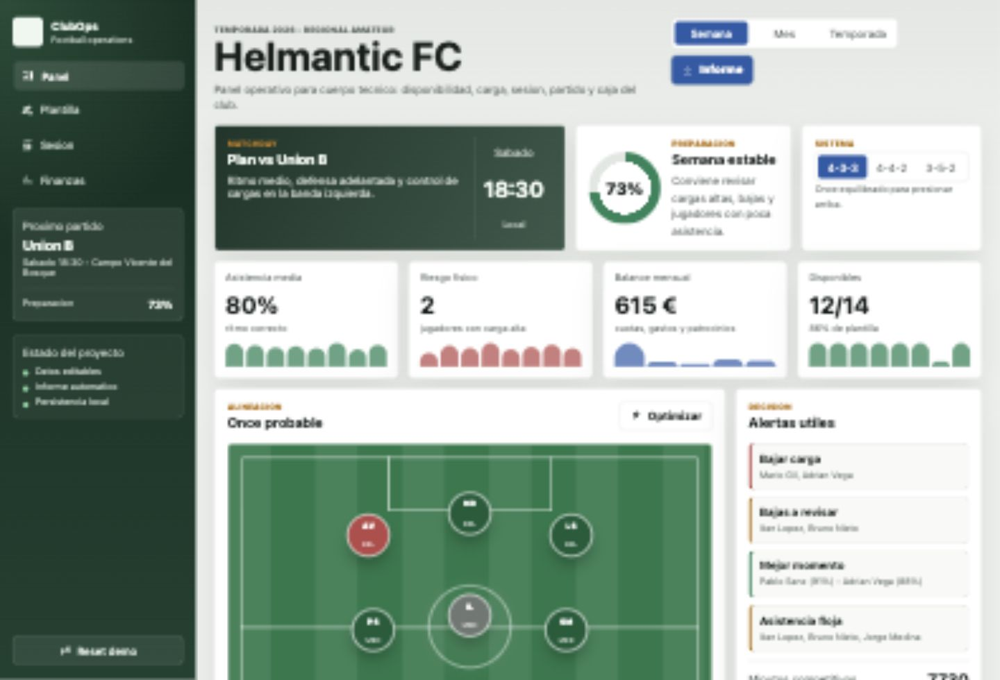

# ClubOps

Dashboard web para gestionar un equipo de futbol amateur: plantilla, cargas, disponibilidad, alineacion, microciclo, finanzas e informes.

[Demo publicada](https://rodrigoocbz.github.io/clubops/)



## Por que existe

ClubOps es un proyecto de portfolio pensado para unir producto, interfaz y criterio de negocio en un caso realista. La idea es que un cuerpo tecnico amateur pueda revisar rapidamente como llega el equipo a partido: quien esta disponible, quien va pasado de carga, como queda el once, que sesion toca y como va la caja del mes.

## Funcionalidades

- Panel de metricas con asistencia, riesgo fisico, balance y disponibilidad.
- Alineacion visual con cambio de formacion entre 4-3-3, 4-4-2 y 3-5-2.
- Ficha editable de jugador con asistencia, carga, forma y disponibilidad.
- Alertas automaticas para cargas altas, bajas y baja asistencia.
- Microciclo semanal con bloques de entrenamiento y carga por dia.
- Modulo de finanzas con ingresos, gastos, balance y grafico.
- Informe automatico para cuerpo tecnico.
- Persistencia en `localStorage`.
- Diseno responsive para escritorio y movil.

## Stack

- HTML
- CSS
- JavaScript
- GitHub Pages

No usa frameworks ni backend. El objetivo era demostrar una app usable, clara y facil de desplegar.

## Como abrirlo en local

Abre `index.html` en el navegador.

Tambien puedes servirlo localmente:

```bash
python3 -m http.server 4173
```

Luego abre:

```text
http://127.0.0.1:4173
```

## Como lo explicaria

> Construi una herramienta ligera para equipos amateur que combina seguimiento deportivo y gestion basica. Me centre en que fuera usable sin backend: estado de plantilla, carga, asistencia, plan de sesion, cambios de formacion, balance economico e informe automatico. El objetivo era demostrar producto, interfaz, estado en cliente y criterio de negocio en un caso que conozco.

## Siguientes mejoras

- Exportar informe en PDF.
- Anadir calendario de partidos.
- Anadir historico de asistencia y cargas.
- Crear backend con API y autenticacion.
- Migrar a React o Next.js si el proyecto crece.
